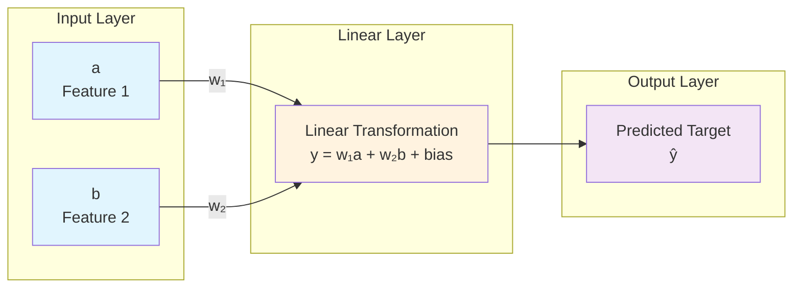

# Neural Network Architecture

This document visualizes the neural network architecture used in the linear regression notebook.

## Network Structure

The neural network has a simple architecture with:
- **2 input neurons** (features: `a` and `b`)
- **1 output neuron** (predicted target value)
- **Linear transformation** with weights and bias

## Visual Representation



## Mathematical Representation

The neural network implements a linear function:

```
ŷ = w₁ × a + w₂ × b + bias
```

Where:
- `a` and `b` are input features
- `w₁` and `w₂` are learned weights
- `bias` is the learned bias term
- `ŷ` is the predicted output

## Expected Learning

The network should learn to approximate the true function:
```
target = 3a + 4b
```

Therefore, the expected learned parameters are:
- `w₁ ≈ 3.0` (weight for feature `a`)
- `w₂ ≈ 4.0` (weight for feature `b`) 
- `bias ≈ 0.0` (bias term)

## Network Details

- **Architecture**: Single linear layer (fully connected)
- **Input size**: 2 features
- **Output size**: 1 prediction
- **Parameters**: 3 total (2 weights + 1 bias)
- **Activation**: None (linear output)
- **Loss function**: Mean Squared Error (MSE)
- **Optimizer**: Stochastic Gradient Descent (SGD) with momentum

## ASCII Art Representation

```
    Input Layer          Linear Layer         Output Layer
    ┌─────────┐         ┌─────────────────┐   ┌─────────┐
    │    a    │────────▶│  w₁a + w₂b + b  │──▶│    ŷ    │
    └─────────┘         │                 │   └─────────┘
    ┌─────────┐         │  (Linear Trans) │
    │    b    │────────▶│                 │
    └─────────┘         └─────────────────┘
```

## Training Process

1. **Forward Pass**: Compute prediction `ŷ = w₁a + w₂b + bias`
2. **Loss Calculation**: Compare with true target using MSE
3. **Backward Pass**: Compute gradients of loss w.r.t. weights
4. **Weight Update**: Adjust weights using SGD optimizer
5. **Repeat**: Continue for multiple epochs until convergence

This simple architecture is perfect for learning linear relationships and serves as an excellent introduction to neural networks!
