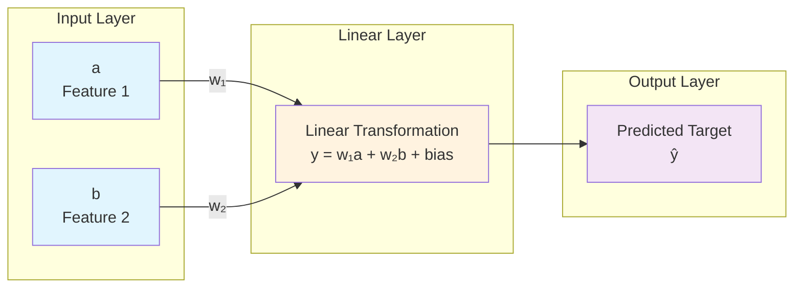
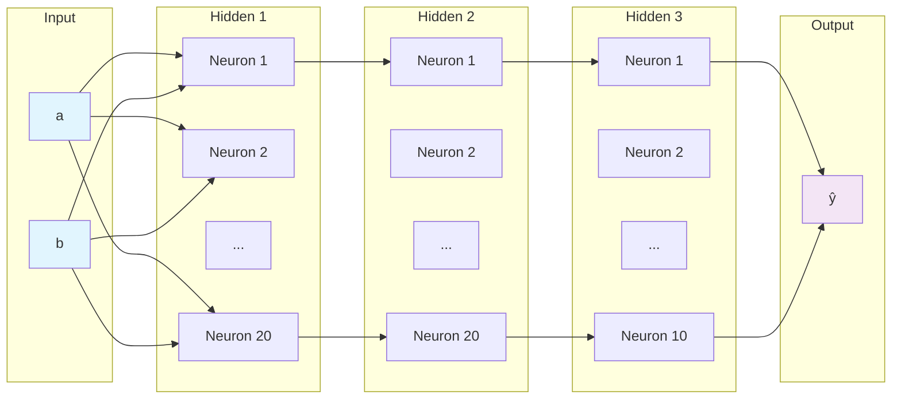

# Neural Network Architecture

This document visualizes the neural network architectures used in both the linear regression and quadratic function notebooks.

## Network Structure

The neural network has a simple architecture with:
- **2 input neurons** (features: `a` and `b`)
- **1 output neuron** (predicted target value)
- **Linear transformation** with weights and bias

## Visual Representation



## Mathematical Representation

The neural network implements a linear function:

```
ŷ = w₁ × a + w₂ × b + bias
```

Where:
- `a` and `b` are input features
- `w₁` and `w₂` are learned weights
- `bias` is the learned bias term
- `ŷ` is the predicted output

## Expected Learning

The network should learn to approximate the true function:
```
target = 3a + 4b
```

Therefore, the expected learned parameters are:
- `w₁ ≈ 3.0` (weight for feature `a`)
- `w₂ ≈ 4.0` (weight for feature `b`) 
- `bias ≈ 0.0` (bias term)

## Network Details

- **Architecture**: Single linear layer (fully connected)
- **Input size**: 2 features
- **Output size**: 1 prediction
- **Parameters**: 3 total (2 weights + 1 bias)
- **Activation**: None (linear output)
- **Loss function**: Mean Squared Error (MSE)
- **Optimizer**: Stochastic Gradient Descent (SGD) with momentum

## ASCII Art Representation

```
    Input Layer          Linear Layer         Output Layer
    ┌─────────┐         ┌─────────────────┐   ┌─────────┐
    │    a    │────────▶│  w₁a + w₂b + b  │──▶│    ŷ    │
    └─────────┘         │                 │   └─────────┘
    ┌─────────┐         │  (Linear Trans) │
    │    b    │────────▶│                 │
    └─────────┘         └─────────────────┘
```

## Training Process

1. **Forward Pass**: Compute prediction `ŷ = w₁a + w₂b + bias`
2. **Loss Calculation**: Compare with true target using MSE
3. **Backward Pass**: Compute gradients of loss w.r.t. weights
4. **Weight Update**: Adjust weights using SGD optimizer
5. **Repeat**: Continue for multiple epochs until convergence

This simple architecture is perfect for learning linear relationships and serves as an excellent introduction to neural networks!

---

## Quadratic Function Neural Network (v0.7)

This section describes the more complex neural network used to learn the quadratic function `f(a, b) = 2a² + 3b + 1`.

### Network Architecture

```
Input Layer → Hidden Layer 1 → Hidden Layer 2 → Hidden Layer 3 → Output Layer
    (2)           (20)             (20)            (10)            (1)
```

### Layer-by-Layer Structure



### Parameter Calculation

#### Layer 1: Input → Hidden 1 (2 → 20)
- **Weights**: 2 × 20 = 40 parameters
- **Biases**: 20 parameters
- **Subtotal**: 60 parameters

#### Layer 2: Hidden 1 → Hidden 2 (20 → 20)
- **Weights**: 20 × 20 = 400 parameters
- **Biases**: 20 parameters
- **Subtotal**: 420 parameters

#### Layer 3: Hidden 2 → Hidden 3 (20 → 10)
- **Weights**: 20 × 10 = 200 parameters
- **Biases**: 10 parameters
- **Subtotal**: 210 parameters

#### Layer 4: Hidden 3 → Output (10 → 1)
- **Weights**: 10 × 1 = 10 parameters
- **Biases**: 1 parameter
- **Subtotal**: 11 parameters

### Total Learnable Parameters

```
Layer 1:   60 parameters
Layer 2:  420 parameters
Layer 3:  210 parameters
Layer 4:   11 parameters
─────────────────────────
Total:    701 parameters
```

### Why 701 Parameters?

The quadratic function requires a non-linear model, which necessitates:
- **Multiple hidden layers** to capture the non-linear relationship
- **ReLU activations** between layers (these don't add parameters)
- **Sufficient neurons** to approximate the quadratic term (a²)

Compared to the linear model with just 3 parameters, this model has **234× more parameters** to learn the more complex quadratic relationship.

### Key Differences from Linear Model

| Aspect | Linear Model | Quadratic Model |
|--------|--------------|-----------------|
| Layers | 1 (input → output) | 4 (3 hidden + output) |
| Parameters | 3 | 701 |
| Activations | None | ReLU (3 times) |
| Can learn | Linear functions | Non-linear functions |
| Training complexity | Low | Higher |

### ASCII Representation

```
  Input      Hidden 1     Hidden 2     Hidden 3    Output
  (2)         (20)         (20)         (10)        (1)
   a ──┬──→ [ReLU] ──→ [ReLU] ──→ [ReLU] ──→  ŷ
       │       ↑           ↑           ↑        ↑
   b ──┴───────┴───────────┴───────────┴────────┘

   60 params    420 params   210 params  11 params

   Total: 701 learnable parameters
```

This architecture successfully learns to approximate `f(a, b) = 2a² + 3b + 1` through its multi-layer structure and non-linear activations!
